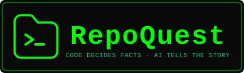

<p align="center">
  
</p>

# RepoQuest

**Paste a public GitHub repo. Play it as a text adventure whose rooms, keys, and monsters are built from the repo's real folders, dependencies, and issues. Every repo name the AI writes in backticks or as a path is checked by code.**

**Core principle:** Code decides facts. AI tells the story. Every name is verified against the repo.

---

## Quick Look

| | |
|---|---|
| **What it is** | A GitHub repo you can play as a text adventure |
| **What's new** | AI narrates, code verifies every repo name it writes |
| **Try it in** | 60 seconds, using the cached demo repo (`github.com/pallets/flask`) |
| **Works without** | AI, and without a network (from cache) |
| **Stack** | Python 3.11+ + Flask + single-page HTML/JS/CSS |
| **No database** | One JSON file per repo in `cache/` |

---

## 1. Project Title
RepoQuest

## 2. One-Line Description
Paste a public GitHub repo and play it as a text adventure. Rooms are real folders, keys are real dependencies, monsters are real open issues (or guardian files when a repo has none), and every name the AI writes is checked by code.

## 3. The Problem
New developers spend days — sometimes weeks — learning an unfamiliar codebase.
- READMEs explain *what* a project does, not *how its parts connect*.
- Folder trees are overwhelming and nobody knows where to start.
- Reading code alone gives no feedback on whether you understood it.
- Existing AI explainers can invent file names that do not exist, and a beginner has no way to tell.

Onboarding is slow, boring, and easy to abandon.

## 4. The Solution
RepoQuest turns a public GitHub repo into a playable text adventure.
- **Folders** become rooms.
- **Dependencies** become keys.
- **Open issues** become monsters. When a repo has no open issues, the largest files become "guardian" monsters instead.
- **The largest file** becomes the boss.
- **The README** is the starting hall.

You explore. You pick up keys. You fight monsters by answering quiz questions about the code. You beat the boss and leave with a working mental map of the project.

**Code = map maker. AI = tour guide reading from the map.** The guide is not allowed to invent places.

## 5. Key Features
- **Deterministic Map Builder:** Rooms, keys, monsters, and the boss come from real repo data, built by plain code — no AI involved.
- **AI Narration with Name Validator:** The LLM writes the prose. Code checks every repo name the AI writes in backticks or as a path against the real file tree.
- **One Retry, Then Template Text:** A fake name triggers one retry. If it fails again, the room uses plain template text. No loops.
- **Works Without AI:** If the LLM fails, times out, or returns garbage, the game falls back to template text and keeps playing.
- **Works Offline:** Pre-cached repos play with Wi-Fi completely turned off.
- **Real Issue Links:** Every issue monster links directly to a real GitHub issue you can open in a new tab. Guardian monsters show the file path they guard.
- **Traffic-Light Repo Check:** Green, yellow, or red with clear explanations.
- **Zero Database, Zero Sessions:** One JSON file per repo.

## 6. Demo Repos
- **Primary Demo Repo:** `github.com/pallets/flask` (pre-cached, 12 rooms, active issues, instant play)
- **Secondary Demo Repo:** `github.com/tiangolo/fastapi` (pre-cached)

## 7. Architecture Overview

```
+------------------------------------------------------+
| BROWSER                                              |
| index.html + app.js + style.css                      |
| - URL input, repo check card                         |
| - Game UI (rooms, buttons, monsters, HUD)            |
| - Three.js background canvas + GSAP animations       |
| - Game state and game rules live here                |
+----------------------+-------------------------------+
                       | HTTP (fetch)
                       v
+------------------------------------------------------+
| FLASK (app.py)                                       |
| POST /api/check -> cache, repo_check, github_fetch,  |
|                    map_builder                       |
| POST /api/start -> cache, narrator, name_validator,  |
|                    quiz                              |
+------+-----------------+------------------+----------+
       |                 |                  |
       v                 v                  v
+------------+    +--------------+   +--------------+
| GITHUB     |    | GEMINI       |   | cache/*.json |
| REST API   |    | (google-     |   | (local disk) |
|            |    |  genai)      |   |              |
+------------+    +--------------+   +--------------+
```

## 8. Project Structure

```
repoquest/
│
├── app.py                  # Flask entry point (/api/check, /api/start, /)
├── vercel.json             # Vercel static deployment config
├── requirements.txt        # Python dependencies
├── .env.example            # API key and configuration template
├── .gitignore              # Git ignore rules
├── LICENSE                 # MIT License
├── README.md               # Project documentation
├── DEMO_SCRIPT.md          # 90-second stage script
├── api.md                  # REST API specification
│
├── modules/
│   ├── __init__.py         # Package initializer
│   ├── repo_check.py       # URL validation & playability check
│   ├── github_fetch.py     # GitHub REST API client (requests, timeout=10)
│   ├── map_builder.py      # Room merging, connectivity check, boss/key/monster placement
│   ├── narrator.py         # LLM narration (google-genai) + template fallback
│   ├── name_validator.py   # Regex extraction & filename validation against real tree
│   ├── quiz.py             # Quiz question generator (Types #1 and #2) & distractor sampling
│   └── cache.py            # JSON cache load/save (cache/owner-repo.json)
│
├── templates/
│   └── index.html          # Single-page HTML shell with Three.js & GSAP CDNs
│
├── static/
│   ├── logo.svg            # Vector brand logo
│   ├── favicon.svg         # 32x32 vector favicon
│   ├── app.js              # Frontend game engine & DOM renderer
│   └── style.css           # Terminal green-on-black monospace theme
│
├── cache/
│   ├── pallets-flask.json      # Pre-cached primary demo repo
│   └── tiangolo-fastapi.json   # Pre-cached secondary demo repo
│
└── tests/
    ├── test_map_builder.py # 3 tests for map building & connectivity
    └── test_validator.py   # 5 tests for filename validation
```

## 9. Prerequisites
- Python 3.11 or newer
- GitHub Personal Access Token (for online mode, 5,000 req/hr)
- Google Gemini API Key (for LLM narration)

## 10. Installation & Getting Started

```bash
# Clone the repository
git clone https://github.com/RohanKodesss/Repoquest.git
cd Repoquest

# Create virtual environment
python3 -m venv venv
source venv/bin/activate  # On Windows: venv\Scripts\activate

# Install dependencies
pip install -r requirements.txt

# Copy environment template
cp .env.example .env
```

Edit `.env` to add your `GITHUB_TOKEN`, `GEMINI_API_KEY`, and `GEMINI_MODEL`.

Run the application:
```bash
flask run
```
Open `http://localhost:5000` in your browser. Paste `github.com/pallets/flask` and click **Check Repo**.

## 11. Testing & Verification

Run the test suite:
```bash
python -m pytest -v
```

All 8 tests will execute:
- `test_map_has_rooms`: Proves map contains rooms.
- `test_all_rooms_and_boss_reachable`: Proves every room and boss are reachable from start.
- `test_no_issues_still_gives_monsters`: Proves guardian files replace missing open issues.
- `test_catches_fake_filename`: Proves fake backticked filename is caught.
- `test_passes_real_filename`: Proves real filenames pass validation.
- `test_accepts_real_dependency_name`: Proves dependency names pass validation.
- `test_prose_slashes_are_not_flagged`: Proves prose slashes (e.g. `and/or`) are ignored.
- `test_trailing_period_is_not_flagged`: Proves trailing punctuation does not cause false positives.

## 12. Deployment (Option A)

RepoQuest is configured for split deployment:
1. **Frontend (Vercel):**
   - Connect the repository to [Vercel](https://vercel.com).
   - Vercel automatically detects `vercel.json` and serves the static frontend assets.
2. **Backend (Render / Railway / Fly.io):**
   - Deploy `app.py` as a Python web service.
   - Set environment variables (`GITHUB_TOKEN`, `GEMINI_API_KEY`, `GEMINI_MODEL`).
3. **Connect Frontend to Backend:**
   - In `static/app.js`, set `const API_BASE = "https://your-backend-service.onrender.com";`.

## 13. For Judges

| Question | Answer |
|---|---|
| **What's the pitch?** | Paste a repo, play it as a dungeon. Code decides facts, AI tells the story. |
| **What's new?** | The LLM cannot hallucinate a filename past the validator. |
| **How do I verify?** | Run `python -m pytest -v`. Turn off Wi-Fi and play `github.com/pallets/flask`. |
| **What if the AI fails?** | The game falls back to template text and keeps playing. |
| **What's missing?** | See Honest Limits below. |

## 14. Honest Limits
- Monster-to-room matching is a heuristic based on file mentions, labels, and keywords.
- When a repo has no open issues, monsters are the largest files ("guardians"), not real problems.
- Public repos only. Large repos are simplified to 12 rooms or fewer.
- The validator checks repo names written in backticks, file extensions, or real path prefixes — not every word in prose.
- Import corridors, fog-of-war map, and multiplayer are not in the MVP.

## 15. License
MIT License
